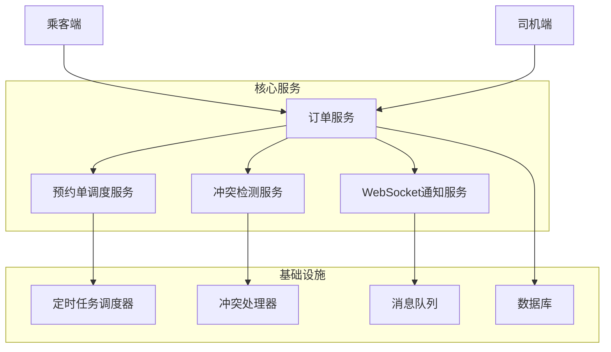
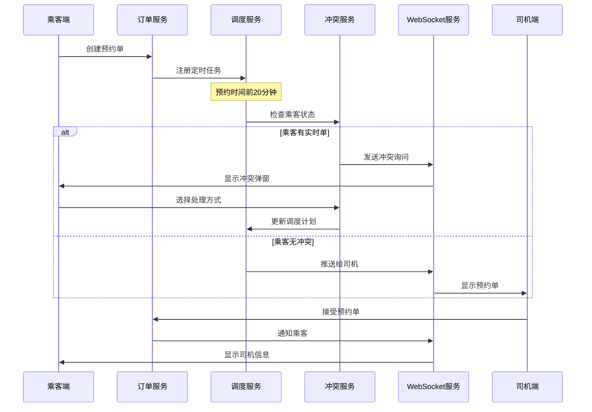

# 预约单功能设计文档

## 概述

预约单功能允许乘客预约未来的用车服务，系统在预约时间前20分钟开始分配司机。当预约单激活时如果乘客正在进行实时单，系统会通过交互式弹窗询问乘客如何处理冲突。

## 架构设计

### 系统架构图



### 数据流图



## 组件设计

### 1. 预约单调度服务 (ScheduledOrderService)

```java
@Service
public class ScheduledOrderService {
    
    /**
     * 创建预约单
     */
    public Order createScheduledOrder(CreateScheduledOrderRequest request) {
        // 1. 验证预约时间
        // 2. 检查乘客当前状态
        // 3. 创建订单记录
        // 4. 注册定时任务
    }
    
    /**
     * 激活预约单（定时任务调用）
     */
    public void activateScheduledOrder(Long orderId) {
        // 1. 检查订单状态
        // 2. 检查乘客冲突
        // 3. 处理冲突或开始分配
    }
    
    /**
     * 处理预约单冲突
     */
    public void handleScheduledOrderConflict(Long orderId, Long passengerId) {
        // 1. 发送冲突询问消息
        // 2. 等待乘客响应
        // 3. 根据响应处理订单
    }
}
```

### 2. 冲突检测服务 (ConflictDetectionService)

```java
@Service
public class ConflictDetectionService {
    
    /**
     * 检查乘客是否有冲突
     */
    public ConflictCheckResult checkPassengerConflict(Long passengerId) {
        // 查询乘客当前进行中的订单
        Order currentOrder = orderMapper.selectCurrentOrderByPassengerId(passengerId);
        
        return ConflictCheckResult.builder()
            .hasConflict(currentOrder != null)
            .conflictOrder(currentOrder)
            .conflictType(determineConflictType(currentOrder))
            .build();
    }
    
    /**
     * 处理冲突响应
     */
    public void handleConflictResponse(Long orderId, ConflictResolution resolution) {
        switch (resolution.getAction()) {
            case CANCEL:
                cancelScheduledOrder(orderId, "乘客取消");
                break;
            case DELAY:
                delayScheduledOrder(orderId, resolution.getDelayMinutes());
                break;
        }
    }
}
```

### 3. WebSocket消息处理

```java
@Component
public class ScheduledOrderWebSocketHandler {
    
    /**
     * 发送冲突询问消息
     */
    public void sendConflictInquiry(Long passengerId, ConflictInquiryMessage message) {
        webSocketNotificationService.sendToPassenger(passengerId, 
            WebSocketMessage.builder()
                .type("SCHEDULED_ORDER_CONFLICT")
                .data(message)
                .build());
    }
    
    /**
     * 推送预约单给司机
     */
    public void pushScheduledOrderToDrivers(Order scheduledOrder) {
        // 1. 查找附近司机
        // 2. 构建预约单消息
        // 3. 批量推送
        List<Driver> nearbyDrivers = findNearbyDrivers(scheduledOrder);
        
        ScheduledOrderPushMessage message = ScheduledOrderPushMessage.builder()
            .type("NEW_SCHEDULED_ORDER")
            .orderId(scheduledOrder.getId())
            .orderType("RESERVATION")
            .scheduledTime(scheduledOrder.getScheduledTime())
            .isScheduled(true)
            .build();
            
        nearbyDrivers.forEach(driver -> 
            webSocketNotificationService.sendToDriver(driver.getId(), message));
    }
}
```

### 4. 定时任务调度器

```java
@Component
public class ScheduledOrderScheduler {
    
    private final ScheduledExecutorService scheduler = 
        Executors.newScheduledThreadPool(10);
    
    /**
     * 注册预约单激活任务
     */
    public void scheduleOrderActivation(Order scheduledOrder) {
        LocalDateTime activationTime = scheduledOrder.getScheduledTime().minusMinutes(20);
        long delay = Duration.between(LocalDateTime.now(), activationTime).toMillis();
        
        if (delay > 0) {
            scheduler.schedule(() -> {
                scheduledOrderService.activateScheduledOrder(scheduledOrder.getId());
            }, delay, TimeUnit.MILLISECONDS);
            
            log.info("已安排预约单激活任务: orderId={}, activationTime={}", 
                scheduledOrder.getId(), activationTime);
        }
    }
    
    /**
     * 系统启动时恢复所有待激活的预约单
     */
    @PostConstruct
    public void recoverScheduledOrders() {
        List<Order> pendingOrders = orderMapper.selectPendingScheduledOrders();
        pendingOrders.forEach(this::scheduleOrderActivation);
        log.info("已恢复 {} 个预约单的定时任务", pendingOrders.size());
    }
}
```

## 数据模型

### 1. 订单实体扩展

```java
// 现有Order实体已包含所需字段，无需修改
public class Order {
    private String orderType;        // "REAL_TIME" | "RESERVATION"
    private LocalDateTime scheduledTime;  // 预约时间
    private String status;           // 订单状态
    // ... 其他现有字段
}
```

### 2. 冲突处理消息模型

```java
@Data
public class ConflictInquiryMessage {
    private Long scheduledOrderId;
    private String scheduledOrderNumber;
    private LocalDateTime scheduledTime;
    private String pickupAddress;
    private String destinationAddress;
    private Order currentOrder;      // 当前进行中的订单
    private List<DelayOption> delayOptions;  // 延后选项
}

@Data
public class DelayOption {
    private String label;           // "延后30分钟"
    private Integer delayMinutes;   // 30
    private LocalDateTime newTime;  // 新的预约时间
}

@Data
public class ConflictResolution {
    private Long orderId;
    private ConflictAction action;  // CANCEL | DELAY
    private Integer delayMinutes;   // 延后分钟数
}

public enum ConflictAction {
    CANCEL,     // 取消预约单
    DELAY       // 延后预约单
}
```

### 3. 司机端预约单消息

```java
@Data
public class ScheduledOrderPushMessage {
    private String type = "NEW_SCHEDULED_ORDER";
    private Long orderId;
    private String orderNumber;
    private String orderType = "RESERVATION";
    private LocalDateTime scheduledTime;
    private Boolean isScheduled = true;
    private String pickupAddress;
    private String destinationAddress;
    private BigDecimal pickupLatitude;
    private BigDecimal pickupLongitude;
    private BigDecimal destinationLatitude;
    private BigDecimal destinationLongitude;
    private BigDecimal estimatedFare;
    private BigDecimal distance;
    private Integer countdown = 15;  // 倒计时秒数
}
```

## 接口设计

### 1. 乘客端API

```java
@RestController
@RequestMapping("/api/orders")
public class ScheduledOrderController {
    
    /**
     * 创建预约单
     */
    @PostMapping("/scheduled")
    public Result<Order> createScheduledOrder(@RequestBody CreateScheduledOrderRequest request) {
        // 实现创建预约单逻辑
    }
    
    /**
     * 获取乘客的预约单列表
     */
    @GetMapping("/passenger/{passengerId}/scheduled")
    public Result<List<Order>> getPassengerScheduledOrders(@PathVariable Long passengerId) {
        // 实现查询预约单列表
    }
    
    /**
     * 取消预约单
     */
    @PostMapping("/{orderId}/cancel-scheduled")
    public Result<String> cancelScheduledOrder(@PathVariable Long orderId) {
        // 实现取消预约单
    }
    
    /**
     * 处理预约单冲突
     */
    @PostMapping("/{orderId}/resolve-conflict")
    public Result<String> resolveConflict(@PathVariable Long orderId, 
                                         @RequestBody ConflictResolution resolution) {
        // 实现冲突处理
    }
}
```

### 2. 司机端API

```java
@RestController
@RequestMapping("/api/drivers")
public class DriverScheduledOrderController {
    
    /**
     * 获取可接的预约单列表
     */
    @GetMapping("/{driverId}/scheduled-orders")
    public Result<List<Order>> getAvailableScheduledOrders(@PathVariable Long driverId) {
        // 实现查询可接预约单
    }
    
    /**
     * 接受预约单
     */
    @PostMapping("/{driverId}/accept-scheduled/{orderId}")
    public Result<Order> acceptScheduledOrder(@PathVariable Long driverId, 
                                            @PathVariable Long orderId) {
        // 实现接受预约单
    }
}
```

## 错误处理

### 1. 异常类型定义

```java
public class ScheduledOrderException extends RuntimeException {
    public static class InvalidScheduleTimeException extends ScheduledOrderException {}
    public static class PassengerConflictException extends ScheduledOrderException {}
    public static class OrderExpiredException extends ScheduledOrderException {}
    public static class SchedulingFailedException extends ScheduledOrderException {}
}
```

### 2. 错误处理策略

- **时间验证错误**: 返回具体的时间要求说明
- **冲突检测错误**: 提供冲突详情和解决建议
- **调度失败**: 记录日志并提供重试机制
- **网络异常**: 实现消息重发和状态同步

## 测试策略

### 1. 单元测试
- 预约单创建逻辑测试
- 冲突检测算法测试
- 时间计算和验证测试
- 消息构建和发送测试

### 2. 集成测试
- 完整的预约单流程测试
- WebSocket消息传递测试
- 定时任务执行测试
- 数据库事务测试

### 3. 端到端测试
- 乘客创建预约单到司机接单的完整流程
- 冲突处理的用户交互测试
- 多种延后场景的测试
- 异常情况的恢复测试